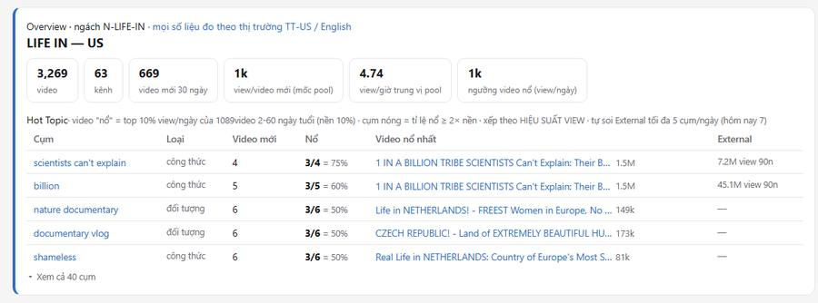
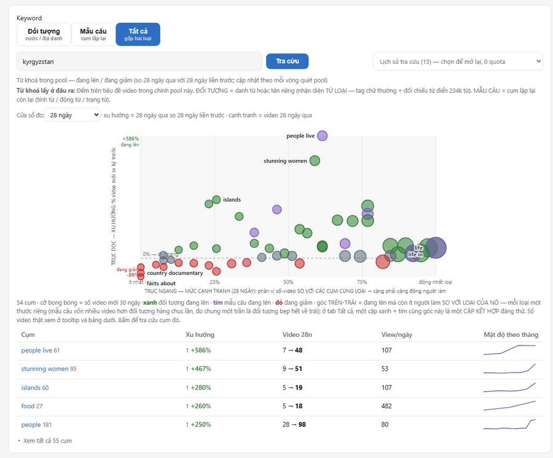
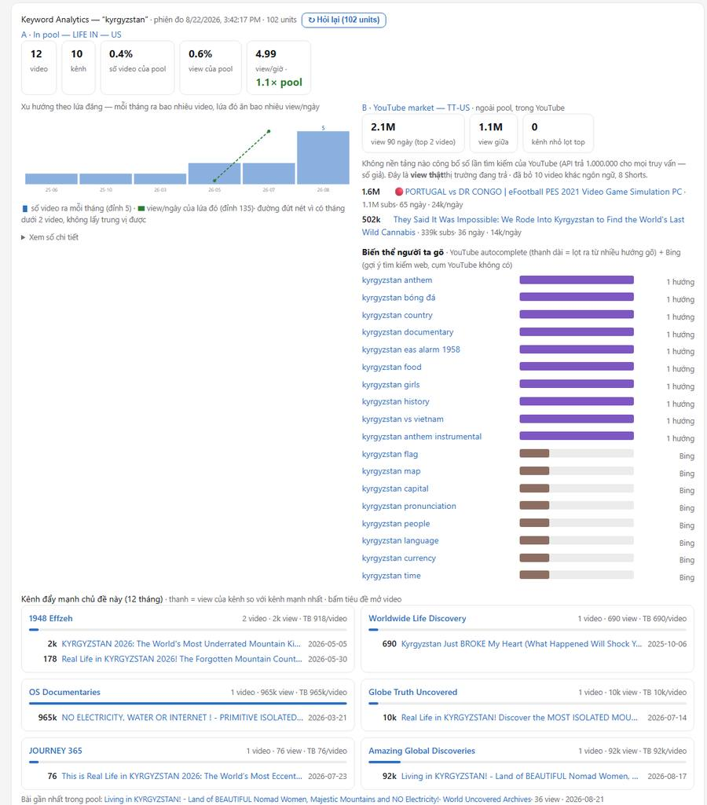
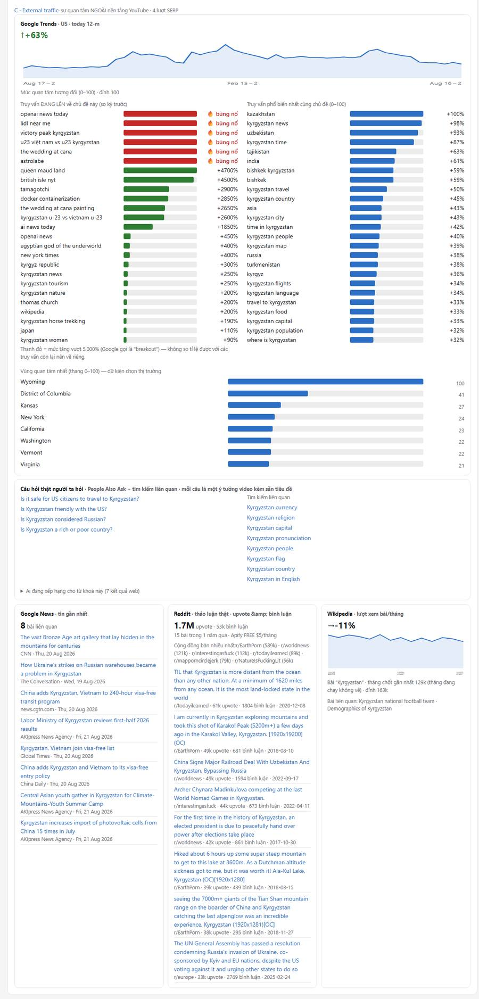

# Sổ tay Mapping — đọc để ra quyết định nội dung

> Bản PDF in sẵn: [`Guideline.pdf`](Guideline.pdf) · Chi tiết kỹ thuật:
> [`CLAUDE.md`](CLAUDE.md) và `docs/discovery-mapping.md` (repo gốc).
> Số liệu minh hoạ lấy từ pool **LIFE IN — US**, ngày 22/08/2026.

Mapping trả lời ba câu hỏi theo đúng thứ tự người làm nội dung cần: **ai đang làm
ngách này**, **họ làm bằng gì mà thắng**, và **mình nên làm video gì tiếp theo**.

---

## 1. Ba khối trên màn hình

Trang Mapping xếp theo thứ tự bạn nên đọc, không phải theo thứ tự dữ liệu về.

| Khối | Tên | Trả lời |
|---|---|---|
| 1 | **Overview** | Sức khoẻ pool + **Hot Topic**: cụm nào đang được video nổ ưu ái. Mở trang là đọc khối này trước — nó nói “hôm nay nên nhìn vào đâu”. |
| 2 | **Keyword** | Bản đồ bong bóng + bảng cụm, chia **Đối tượng** / **Mẫu câu** / **Tất cả**. Chỗ soi cấu trúc ngách và tìm khoảng trống. |
| 3 | **Keyword Analytics** | Bấm một cụm là xuống đây: **A · In pool** (đối thủ trong pool), **B · YouTube market** (ngoài pool), **C · External traffic** (ngoài YouTube). |

*Overview — sáu chip sức khoẻ pool, rồi bảng Hot Topic 5 dòng. Cột **Nổ** là thứ
đáng nhìn nhất; cột **External** cho biết cụm nào đã soi thị trường ngoài.*

> **Quy tắc đọc xuyên suốt.** Mọi con số đều so với **chính phiên đo**, không có
> ngưỡng tuyệt đối nào từ trên trời. “Cao” nghĩa là cao so với các cụm cùng đợt
> trong chính pool của bạn. Mẫu quá nhỏ thì hệ nói thẳng “ít mẫu” chứ không đoán.

---

## 2. Quy trình 1 — Tìm đối thủ

Mục tiêu: phát hiện kênh và chủ đề đang ăn *trước khi* chúng bão hoà.

### Bước 1 — Mở Overview, đọc Hot Topic

Bảng này xếp theo **hiệu suất view**, không theo số video đăng. “Nổ” = video lọt
top 10% view/ngày của chính pool; cụm nóng = tỉ lệ nổ ≥ 2× nền.

Đọc thật, pool LIFE IN — US:

| Nổ | Cụm | Video nổ nhất |
|---|---|---|
| **3/4 = 75%** | `scientists can't explain` | **1,53 triệu view** |
| 3/5 = 60% | `billion` | 1,53 triệu view |
| 3/6 = 50% | `nature documentary` | 149k view |

Đọc: 4 video mới dùng cụm “scientists can't explain”, 3 trong số đó nổ. Đây là
**công thức tiêu đề** đang ăn, không phải chủ đề.

### Bước 2 — Sang Keyword, chọn cửa sổ đo đúng câu hỏi

| Cửa sổ | Trả lời câu hỏi | Dùng khi |
|---|---|---|
| **7 ngày** | Tuần này có gì mới nhú? | Săn sóng sớm, chấp nhận mẫu mỏng |
| **28 ngày** | Tháng này ai đang đẩy? | Mặc định — cân bằng tốt nhất |
| **90 ngày** | Sóng quý này là gì? | Lên kế hoạch nội dung dài |
| **Toàn thời gian** | Ngách này vốn có gì? | Hiểu nền, không dùng để săn |

Cùng một pool, mỗi cửa sổ kể một chuyện khác: 7 ngày ra `vietnam` +133%,
28 ngày ra `tajikistan` +500%, 90 ngày ra `stunning women` +2000%.

### Bước 3 — Đọc bản đồ bong bóng theo bốn góc

Trục ngang = mức cạnh tranh (phân vị **trong loại của nó**). Trục dọc = xu hướng.
Cỡ bong bóng = số video mới 30 ngày.

| Góc | Nghĩa | Hành động |
|---|---|---|
| ◤ Trên–trái | Đang lên mà còn ít người làm | **Chỗ vào** — soi kỹ trước |
| ◥ Trên–phải | Đang lên và đông người làm | Đỏ lửa — phải hơn hẳn mới thắng |
| ◢ Dưới–phải | Đông người làm mà đang xuống | Bão hoà — tránh |
| ◣ Dưới–trái | Ít cả hai | Hoang — thường có lý do, kiểm trước |

**Màu nói loại:** 🟢 xanh = đối tượng đang lên (làm video *về cái gì*) ·
🟣 tím = mẫu câu đang lên (đặt tiêu đề *thế nào*) · 🔴 đỏ = đang giảm.

*Keyword — ba tab đứng đầu · ô tra cứu và dropdown lịch sử · bộ chọn **Cửa sổ đo**
ngay trên bản đồ · bong bóng xanh–tím–đỏ · bảng 5 dòng bên dưới.*

> **Mẹo cặp kết hợp.** Ở tab **Tất cả**, một cặp **xanh + tím cùng nằm góc
> trên–trái** là một video đáng thử: chủ đề đang lên ghép với công thức tiêu đề
> đang lên. Ví dụ thật: `tajikistan` (xanh, +375%) × `stunning women` (tím, +478%).

---

## 3. Quy trình 2 — Nghiên cứu đối thủ

Bấm một cụm bất kỳ để xuống **Keyword Analytics**. Ba khối A/B/C trả lời ba câu
khác nhau — đừng trộn.

### A · In pool — đối thủ trong tầm mắt

Chỉ tính các kênh bạn đang theo dõi trong pool. Đọc thật, cụm `tajikistan`:

| Số | Đọc là |
|---|---|
| **29 video / 21 kênh** | Chủ đề đã có người làm, nhưng chưa ai độc chiếm |
| **18,91 view/giờ** vs pool 4,61 | **4,1× pool** — chủ đề này chạy nhanh hơn mặt bằng |
| **0,9% video · 0,4% view** | Chiếm ít chỗ trong pool, còn dư địa |

**Kênh đẩy mạnh chủ đề này** là phần quan trọng nhất của khối A: mỗi thẻ cho biết
kênh đó làm *bao nhiêu bài*, ăn *bao nhiêu view*, và **chính xác những bài nào**.

| View | Kênh | Bài |
|---|---|---|
| **18.505** | The Global Truth | 2 · TB 9k/video — **hiệu suất cao nhất** |
| 4.119 | Worldwide Life Discovery | 2 |
| 3.861 | Globe Real Life | 3 · làm nhiều nhất nhưng view thấp nhất |

Đọc ngược: kênh **làm nhiều mà view thấp** = công thức của họ chưa ăn. Kênh **làm
ít mà view cao** = mở bài của họ ra xem ngay, đó là mẫu đáng học.

### B · YouTube market — ngoài pool, vẫn trong YouTube

- **view 90 ngày** — tổng view thật thị trường trả. Không nền tảng nào công bố
  lượng tìm kiếm YouTube (API trả 1.000.000 cho mọi truy vấn — số giả), nên đây là
  thước lượng đáng tin duy nhất.
- **Kênh nhỏ lọt top** — **> 0 là tín hiệu tốt**: chủ đề không bị kênh lớn khoá
  cửa, người mới vẫn chen được.
- **Biến thể người ta gõ** — YouTube autocomplete (tím) + Bing (nâu). Thanh dài =
  lọt ra từ nhiều hướng gõ khác nhau.

*A · In pool (trái: chips, dòng đối chiếu cụm rút gọn, biểu đồ lứa đăng) và
B · YouTube market (phải: view 90 ngày, kênh nhỏ lọt top, biến thể người ta gõ) —
đặt cạnh nhau để so trong-pool với ngoài-pool trong một tầm mắt. Dưới cùng là thẻ
kênh đối thủ.*

### C · External traffic — ngoài nền tảng YouTube

| Nguồn | Cho biết | Dùng để |
|---|---|---|
| **Google Trends** | Đường quan tâm 12 tháng + **vùng quan tâm nhất** | Chủ đề đang lên hay đang chết; nên nhắm thị trường/bang nào |
| **Câu hỏi thật** | People Also Ask + tìm kiếm liên quan | Ý tưởng video và tiêu đề — xem quy trình 3 |
| **Google News** | Tin gần nhất quanh chủ đề | Bắt sóng thời sự, tránh làm bài đã lỗi thời |
| **Reddit** | Upvote · bình luận · cộng đồng nào bàn | Nghe ngôn ngữ thật của khán giả (bấm mới chạy, ~0,016 USD) |

*C · External traffic — Google Trends chiếm trọn chiều ngang (đường 12 tháng ·
truy vấn đang lên · phổ biến nhất · vùng quan tâm), rồi **Câu hỏi thật**, và hàng
cuối News · Reddit · Wikipedia. Mục xổ “Người tìm chủ đề này cũng tìm gì” nằm dưới
hai cột truy vấn — xem bẫy số 2.*

---

## 4. Quy trình 3 — Viết content

Ba nguyên liệu, lấy ở ba chỗ khác nhau trên cùng một màn hình.

### Bước 1 — Chủ đề: bong bóng xanh góc trên–trái

Đối tượng đang lên mà ít người làm. Kiểm chéo với khối C: nếu Google Trends cũng
đang lên thì cầu ngoài thị trường xác nhận, không phải chỉ vài kênh trong pool tự
đẩy nhau.

### Bước 2 — Tiêu đề: bong bóng tím và Hot Topic

Mẫu câu đang lên chính là khuôn tiêu đề đang ăn. Ghép với chủ đề ở bước 1:

| Vai | Lấy được |
|---|---|
| chủ đề | `tajikistan` — xanh, +375%, mới 29 video/21 kênh |
| công thức | `stunning women` — tím, +478% |
| hoặc | `scientists can't explain` — 75% video nổ |

Trước khi chốt, mở thẻ kênh của **The Global Truth** xem bài 16k view của họ đặt
tiêu đề thế nào — học cấu trúc, đừng chép chữ.

### Bước 3 — Nội dung: “Câu hỏi thật người ta hỏi”

Khối này là mỏ vàng bị bỏ quên: mỗi câu là một **ý tưởng video kèm sẵn tiêu đề**,
và là câu người thật gõ vào Google chứ không phải cụm máy sinh ra.

Câu hỏi thật cho `kyrgyzstan`:

- Is it safe for US citizens to travel to Kyrgyzstan?
- Is Kyrgyzstan friendly with the US?
- Is Kyrgyzstan considered Russian?
- Is Kyrgyzstan a rich or poor country?

Bốn câu này là bốn đoạn trong dàn bài, hoặc bốn video riêng. Bấm vào câu nào là
tra luôn cụm đó.

Bổ sung bằng **Reddit** khi cần giọng nói thật: đọc bài nhiều upvote để lấy cách
người ta kể chuyện, và xem **cộng đồng nào** bàn nhiều nhất để biết khán giả tụ ở đâu.

> **Một vòng làm việc gọn: 10 phút.** Overview đọc Hot Topic → Keyword đặt cửa sổ
> 28 ngày, tab Tất cả, nhặt một cặp xanh + tím góc trên–trái → bấm cụm xanh →
> khối A xem ai đang làm và bài nào ăn → khối C đọc câu hỏi thật → ra dàn bài.
> Toàn bộ 0 quota trừ khi bạn bấm hỏi ngoài.

---

## 5. Bảng đọc số

| Chỉ số | Nghĩa | Đáng chú ý khi |
|---|---|---|
| **Nổ k/n** | k trong n video mới dùng cụm này lọt top 10% view/ngày | ≥ 2× nền phiên (nền thường ~10%) |
| **Xu hướng %** | Số video mới kỳ này so kỳ trước | > +15% là “lên”, < −15% là “xuống” |
| **Video 28n** | trước → nay, ví dụ `9 → 51` | Nhảy bậc = nhiều kênh vừa đổ vào |
| **View/ngày** | Trung vị của video dùng cụm này | So với các cụm cùng bảng, không so tuyệt đối |
| **view/giờ (khối A)** | Tốc độ chạy của cụm | ≥ 2× trung vị pool |
| **Kênh nhỏ lọt top** | Kênh < 50k subs vẫn lọt top view | > 0 → cửa còn mở cho người mới |
| **TB view/video** | Hiệu suất của một kênh trên chủ đề | Cao mà ít bài = mẫu đáng học |

---

## 6. Bảy cái bẫy

**1 · Cụm dài và cụm ngắn không thay nhau được.**
Hệ khớp theo ranh giới từ: `life in kyrgyzstan` ra 7 video/7 kênh, còn
`kyrgyzstan` ra 12/10 — *Real Life in KYRGYZSTAN* rơi khỏi cụm dài. Cụm **dài đo
cạnh tranh trong công thức ngách**; cụm **ngắn đo chủ đề** và hợp hơn khi hỏi khối
C, vì ngoài đời người ta gõ tên nước chứ không gõ “life in…”. Khối A tự hiện dòng
đối chiếu.

**2 · “Người tìm chủ đề này cũng tìm gì” không phải nhu cầu của ngách.**
Google Trends xếp “đang lên” theo *nhóm người* cùng tìm, không theo chủ đề. Chủ đề
ít người quan tâm thì nhóm nhỏ, nên `lidl near me`, `openai news today` lọt vào.
Hệ đã tách chúng xuống mục xổ riêng — đừng kéo lên coi như tín hiệu.

**3 · Khung giờ gần nhất luôn thấp giả.**
Video cũ chỉ được quét 1 lần/24 giờ nên khung mới nhất chưa được điền đủ. Biểu đồ
Nhịp pool đã tự tách chúng ra khỏi đường vẽ — số ở dòng ghi chú cam là số *chưa
chốt*, sẽ tự tăng lên.

**4 · Cửa sổ đo đổi thì kết luận đổi.**
Một cụm có thể +500% ở 28 ngày nhưng đi ngang ở 90 ngày. Không có cửa sổ nào
“đúng” — phải nói rõ bạn đang trả lời câu hỏi nào. Khi báo cáo cho người khác,
luôn ghi kèm cửa sổ.

**5 · Đối tượng của ngách này không phải đối tượng của ngách kia.**
Ngách LIFE IN đặt tiêu đề *Life in X* nên đối tượng là tên nước. Ngách SPACE đặt
*Mars Is Hiding Something* — đối tượng làm chủ ngữ, và nhiều khi là cụm hai từ
(`solar system`, `james webb`). Nếu tab Đối tượng trống, sang tab **Tất cả** chứ
đừng kết luận pool không có dữ liệu.

**6 · Quota không vô hạn.**
Trends + câu hỏi thật tiêu lượt SERP (hiện ngay tiêu đề khối C). Reddit tiêu tiền
Apify. Bản đã hỏi được lưu — mở lại từ dropdown **Lịch sử tra cứu** là 0 đồng.
Đừng hỏi lại cụm cũ chỉ để xem lại.

**7 · Mỗi từ khoá là một phiên đo riêng.**
Hai cụm tra ở hai thời điểm khác nhau thì không đặt cạnh nhau để so được. Lịch sử
tra cứu chỉ để *xem lại* đúng kết quả phiên đó, không phải để xếp hạng chéo.
