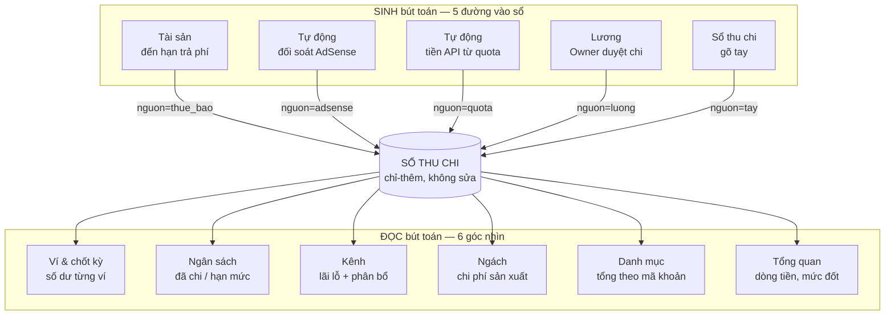
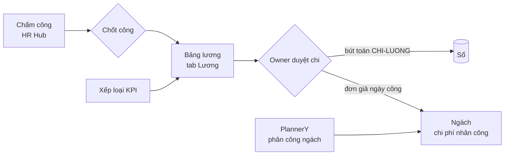
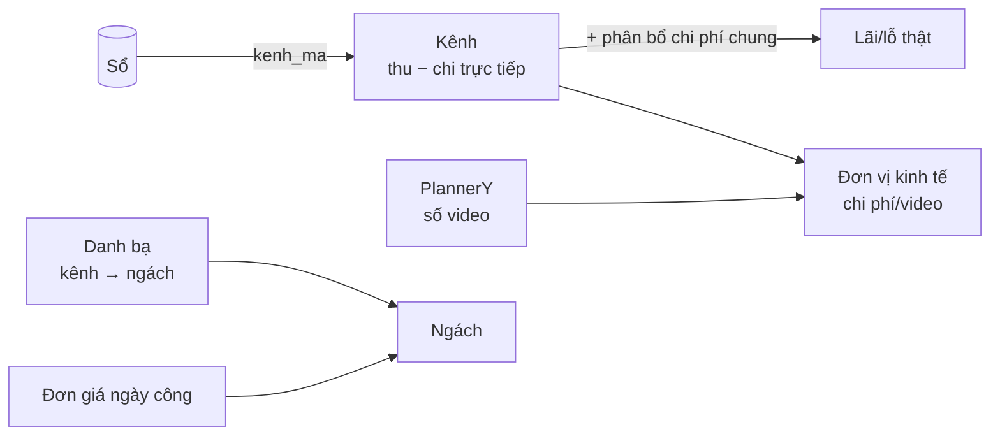
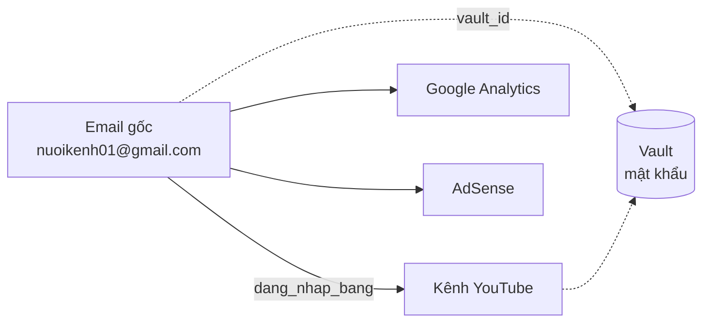

# Finance Hub — 11 tab liên kết với nhau ra sao

> Trả lời câu hỏi của Owner 07/09: các tính năng nối nhau thế nào, và làm việc
> theo trình tự nào. Viết từ code thật đang chạy, không phải ý định thiết kế.

## 1. Một câu tóm tắt

**Bút toán là trung tâm. Mọi tab khác hoặc SINH ra bút toán, hoặc ĐỌC bút toán
để tính ra một góc nhìn.** Không có dữ liệu nào tồn tại song song với sổ.

Cột `nguon` trên mỗi bút toán ghi nó đến từ đường nào — nhìn sổ là biết dòng này
do máy dựng sẵn hay người gõ tay.

## 2. Mỗi bút toán mang sáu mối nối

Đây là chỗ ràng buộc chặt nhất của cả hệ. Một dòng trong sổ **bắt buộc** trỏ tới:

| Trường | Trỏ tới | Bắt buộc | Ai dùng mối nối này |
|---|---|---|---|
| `danh_muc` | Danh mục khoản | ✔ | quyết định thu hay chi · tab Danh mục · biểu đồ cơ cấu |
| `muc_tieu` | Mục tiêu ngân sách | ✔ | tab Ngân sách tính "đã chi" |
| `vi` | Ví tiền | ✔ | tab Ví tính số dư · chốt kỳ đối chiếu |
| `tien_te` + `ty_gia` | Sổ tỷ giá | ✔ (suy từ ví) | mọi phép cộng quy về đồng Việt Nam |
| `kenh_ma` | Danh bạ kênh | — (rỗng = chung hệ) | tab Kênh · tab Ngách (qua kênh→ngách) |
| `nguon` | Đường sinh ra nó | ✔ | truy vết, và chặn ghi trùng |

Vì `danh_muc` quyết định thu/chi, người ghi **không thể chọn lệch** — chọn
`THU-ADS` thì là thu, không có ô nào để ghi đè.

## 3. Bốn chuỗi phụ thuộc — thứ tự bắt buộc

Đây là phần Owner cần nắm nhất: **có những việc không làm trước được**.

### Chuỗi 1 — Lương nuôi Ngách

**Chưa duyệt lương thì tab Ngách không có chi phí nhân công** — ô đó ghi *"lương
chưa duyệt"* chứ không đoán. Lấy lương dự kiến làm chi phí là bịa số.

### Chuỗi 2 — Ví nuôi Chốt kỳ

Số dư ví **không nhập tay** — nó cộng ra từ bút toán. Khi chốt kỳ, anh khai số dư
thật của từng ví, hệ so với số nó tính ra. Lệch thì **khóa chốt** cho tới khi có
bút toán giải trình.

### Chuỗi 3 — Tài sản nuôi Sổ

Tài sản có chu kỳ trả phí → đến hạn hiện ở hàng chờ → bấm Ghi → sinh bút toán
mang `danh_muc` và `vi` **đã khai sẵn trên tài sản đó** → hạn tự đẩy sang kỳ sau.

Nên tab Thuê bao không phải sổ riêng: nó lọc chính sổ tài sản.

### Chuỗi 4 — Kênh nuôi Ngách, và cả hai nuôi quyết định

Chi phí "chung hệ" (API, tool, lương) không thuộc kênh nào. Nếu để nguyên một
hàng thì **mọi kênh đều trông có lãi** — nên tab Kênh rải nó xuống theo quy tắc
anh chọn.

## 4. Tài sản: hai mối nối riêng

- **`dang_nhap_bang`** dựng cây cha–con. Mất một email là mất cả chùm, nên cảnh
  báo "chưa cất két" nói rõ nó đang đỡ mấy tài khoản.
- **`vault_id`** là mối nối duy nhất sang két. Sổ giữ **ID đăng nhập** để tra cứu
  nhanh; **mật khẩu chỉ ở Vault**.

## 5. Flow làm việc

### Hằng ngày — Kế toán

1. Có chi tiêu → tab **Sổ thu chi** → *+ Bút toán mới* → chọn ví, mục tiêu, kênh,
   đính kèm ảnh hóa đơn.
2. Gõ ghi chú, hệ tự điền danh mục và ví nếu khớp luật gợi ý — sửa được.
3. Ghi sai → bấm **Đảo**, rồi ghi lại dòng đúng. Không sửa, không xóa.

### Đầu tháng — mở kỳ

| Bước | Ở đâu | Vì sao |
|---|---|---|
| Lấy tỷ giá USD | Ví & chốt kỳ | Chưa có tỷ giá thì bút toán ngoại tệ bị chặn |
| Xem hàng chờ thuê bao | Tổng quan | Khoản nào đến hạn, khoản nào đã quá hạn |
| Đặt hạn mức nếu đổi | Ngân sách | Để tiến độ chi có mốc mà so |

### Ngày 10–12 — Google chốt tiền

1. Tải CSV chi trả từ AdSense.
2. Tab **Tự động** → nạp CSV → hệ khớp tên kênh với danh bạ, so với doanh thu ước
   tính đã ghi, chỉ ra chênh lệch.
3. Soát bảng nháp, sửa số nếu cần → **Duyệt** → bút toán vào sổ.
4. Cũng tại tab này: **Tạo bút toán tổng hợp** tiền API của tháng.

### Sau đối soát — chốt kỳ

1. Mở từng ví thật, xem số dư.
2. Tab **Ví & chốt kỳ** → khai số dư thật → **Chốt kỳ**.
3. Lệch thì ghi bút toán giải trình rồi chốt lại. Không có cách chốt đè.

### Ngày 15 — trả lương

| Bước | Ai làm | Ở đâu |
|---|---|---|
| Chốt công kỳ | HR | HR Hub |
| Chấm xếp loại A/B/C | Quản lý | KPI |
| Điều chỉnh (nếu có) kèm lý do | HR | Lương |
| Duyệt chi | **Owner** | Lương |
| Xuất và gửi phiếu | HR | Lương |

Duyệt xong thì tab **Ngách** mới có chi phí nhân công của kỳ đó.

### Khi có tài sản mới

- **Vật lý**: khai → bàn giao cho người dùng. Nghỉ việc thì thu hồi.
- **Số**: khai → điền ID đăng nhập → cất mật khẩu vào Vault → dán mã Vault vào.
  Nếu đăng nhập bằng email khác thì chọn ở ô *Đăng nhập bằng*.
- Có phí lặp → điền chu kỳ + mã khoản + ví, từ đó hệ tự nhắc.

### Cuối tháng — đọc kết quả

| Câu hỏi | Xem ở |
|---|---|
| Tháng này lãi hay lỗ | Tổng quan |
| Tiền còn nuôi được mấy tháng | Tổng quan — mức đốt |
| Kênh nào đáng nuôi tiếp | Kênh — lãi/lỗ sau phân bổ + đơn vị kinh tế |
| Ngách nào ngốn người | Ngách |
| Cắt gì thì tiết kiệm nhất | Tài sản — chi định kỳ |

## 6. Chỗ liên kết còn hở — nói thẳng

| Chỗ hở | Hệ quả | Cần gì để đóng |
|---|---|---|
| **Lượt xem chưa nối** | Đơn vị kinh tế thiếu cột *chi phí/1K view* | Nối Data Analytics |
| **Tài sản chưa vào sổ tiền lúc mua** | Mua máy 45 triệu phải gõ bút toán riêng, hệ không tự nối | Nút "ghi bút toán mua" trên tài sản |
| **Chưa có khấu hao** | Nguyên giá tài sản không phân bổ dần vào chi phí tháng | Owner quyết có cần hạch toán khấu hao không |
| **Ngách chia đều ngày công** | Người làm nhiều ngách thì chia đều, chưa theo số video thật | Chờ PlannerY gắn video với tên người |

Ba cái đầu là **việc chưa làm**, không phải lỗi — hệ đang nói thẳng chỗ thiếu chứ
không đoán số.
