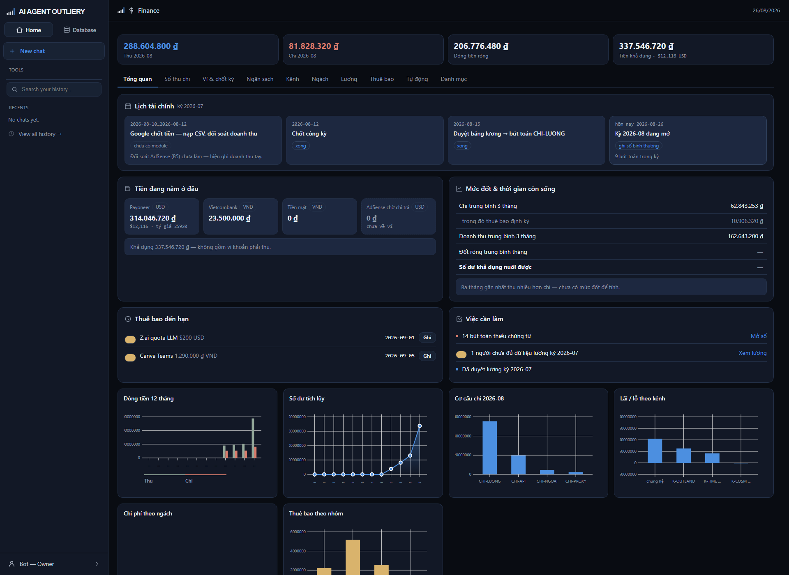

# Tab Tổng quan

> Trang mở đầu. Nhìn một phát biết tiền còn bao nhiêu, sắp phải làm gì, và có
> việc gì đang chờ.

## Bốn ô số trên cùng

Bốn ô này theo bạn qua **mọi tab**, luôn nói về tháng đang chọn.

| Ô | Nghĩa |
|---|---|
| **Thu** | Tổng tiền vào trong tháng, đã quy về đồng Việt Nam |
| **Chi** | Tổng tiền ra trong tháng |
| **Dòng tiền ròng** | Thu trừ Chi. Đỏ nghĩa là tháng này tiêu nhiều hơn kiếm |
| **Tiền khả dụng** | Tiền thật đang có trong các ví, **không tính** khoản AdSense chưa về |

Khi hệ tính được số tháng còn nuôi được, ô thứ tư đổi thành **"còn nuôi được X
tháng"** và chuyển đỏ nếu dưới 6 tháng.

## Lịch tài chính

Bốn thẻ là bốn mốc của kỳ vừa xong. Màu viền cho biết trạng thái:

| Thẻ | Nghĩa |
|---|---|
| Viền thường | Chưa tới hạn |
| Viền xanh | Đang tới hạn, làm được rồi |
| Viền đỏ + nhãn *trễ hạn* | Quá hạn mà chưa làm |
| Nhãn *xong* | Đã làm |
| Nhãn *chưa có module* | Việc đó hệ chưa làm được, đang phải làm tay |

Dưới mỗi thẻ là lý do đang bị khóa, ví dụ *"Chưa chốt công kỳ này"* — nghĩa là
phải chốt công trước thì nút duyệt lương mới mở.

Hệ **chỉ nhắc, không tự chạy**. Trễ hạn thì thẻ chuyển đỏ và nằm đó cho tới khi
có người làm.

## Tiền đang nằm ở đâu

Mỗi ví một ô, hiện số dư quy ra đồng Việt Nam. Ví ngoại tệ có thêm dòng nhỏ ghi
số nguyên tệ và tỷ giá đang dùng.

Ô viền đứt nét là **khoản phải thu** — tiền AdSense Google đã tính nhưng chưa
chuyển. Nó **không** được cộng vào "Tiền khả dụng", vì chưa vào ví thì chưa phải
tiền của mình.

## Mức đốt & thời gian còn sống

| Dòng | Nghĩa |
|---|---|
| Chi trung bình 3 tháng | Trung bình chi của ba tháng gần nhất |
| trong đó thuê bao định kỳ | Phần cố định hằng tháng, cắt được nếu cần |
| Doanh thu trung bình 3 tháng | Trung bình thu |
| Đốt ròng trung bình tháng | Chi trừ Thu — mỗi tháng hụt bao nhiêu |
| **Số dư khả dụng nuôi được** | Tiền còn ÷ mức đốt = còn sống được mấy tháng |

Ba trường hợp hệ **không** đưa ra con số, và nói rõ vì sao:

- **Thu nhiều hơn chi** → không có mức đốt nên không có khái niệm "còn mấy tháng".
- **Hết tiền khả dụng** → báo cạn quỹ.
- **Chỉ 1–2 kỳ có số** → vẫn tính nhưng gắn nhãn đỏ *"chỉ N kỳ có số"* để bạn
  biết trung bình này chưa đáng tin.

## Thuê bao đến hạn

Dịch vụ sắp phải trả tiền trong 14 ngày tới, kèm cả khoản **đã quá hạn** (chấm
đỏ). Bấm **Ghi** để nhảy sang tab Thuê bao ghi bút toán.

## Việc cần làm

Chỉ liệt kê việc **đếm được từ dữ liệu thật**: bao nhiêu bút toán thiếu chứng từ,
bao nhiêu thuê bao quá hạn, bao nhiêu người chưa đủ dữ liệu lương, đã có tỷ giá
hôm nay chưa. Không có việc chung chung.

## Biểu đồ

Năm biểu đồ ở cuối trang: dòng tiền 12 tháng, số dư tích lũy, cơ cấu chi, lãi lỗ
theo kênh, chi phí theo ngách, thuê bao theo nhóm.

Sổ chưa có bút toán nào thì khu biểu đồ **không hiện** — thay bằng một dòng chữ.
Hệ không vẽ trục rỗng trông như đã đo.
