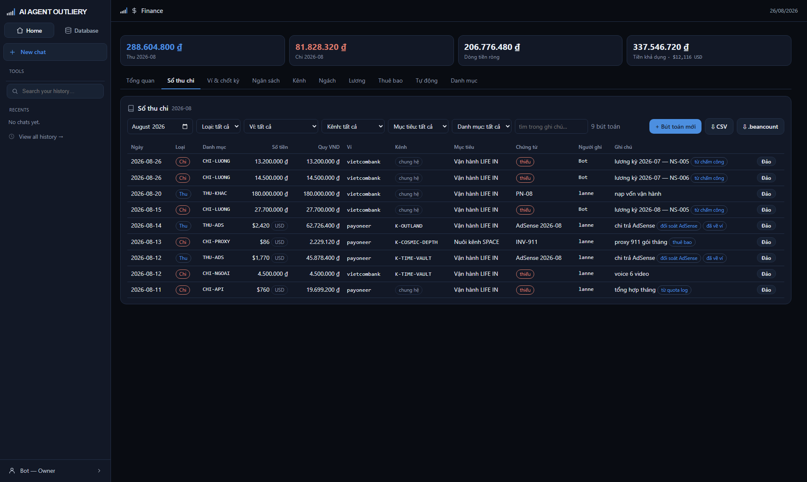
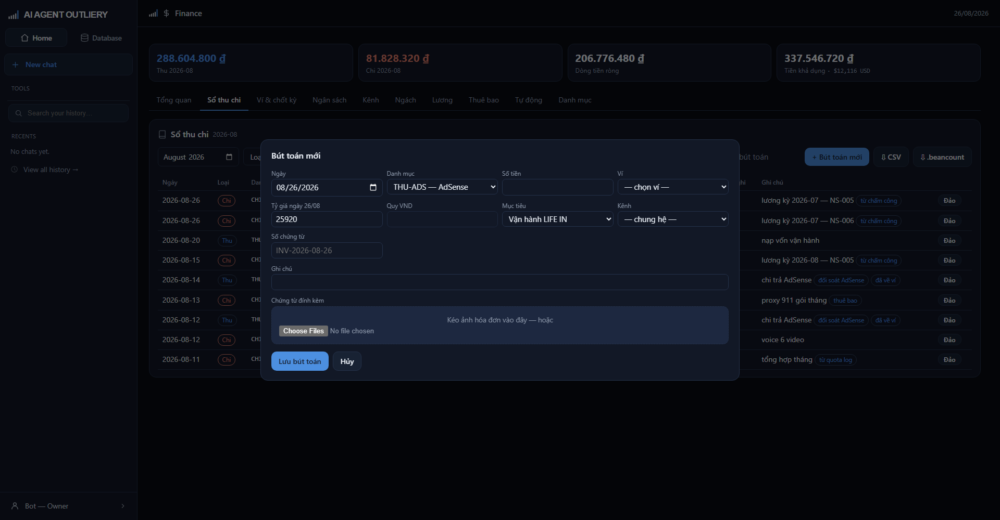

# Tab Sổ thu chi

> Nơi ghi từng đồng vào ra. Đây là gốc của mọi con số trong các tab khác.

## Thanh lọc

Một hàng dropdown, **chọn là lọc ngay**, không cần bấm nút. Điều kiện để trống
nghĩa là không lọc theo cột đó.

| Ô | Lọc theo |
|---|---|
| Kỳ | Tháng |
| Loại | Thu · Chi · Đảo |
| Ví | Tiền vào/ra khỏi ví nào |
| Kênh | Kênh cụ thể, hoặc để trống xem tất cả |
| Mục tiêu | Mục tiêu ngân sách |
| Danh mục | Mã khoản |
| Tìm trong ghi chú | Gõ chữ bất kỳ, tìm cả trong số chứng từ |

Số bút toán khớp hiện ngay cạnh. Hai nút xuất **mang theo đúng điều kiện đang
lọc** — thấy gì trên màn thì xuất ra đúng thế.

- **⇩ CSV** — mở bằng Excel, có sẵn cột quy đổi ra đồng Việt Nam.
- **⇩ .beancount** — tệp cho phần mềm kế toán Fava, xem báo cáo chuẩn mà không
  cần dựng thêm gì.

## Bảng sổ

| Cột | Ghi chú |
|---|---|
| Ngày | Ngày phát sinh, không phải ngày nhập |
| Loại | Thu (xanh) · Chi (đỏ) · Đảo (xám) |
| Số tiền | Nguyên tệ. Ngoại tệ có nhãn mã tiền tệ bên cạnh |
| Quy VND | Quy theo tỷ giá đã chốt lúc ghi |
| Ví | Tiền vào/ra khỏi ví nào |
| Kênh | Nhãn *chung hệ* nghĩa là không thuộc kênh nào |
| Chứng từ | Bấm vào tên tệp để tải. Nhãn đỏ *thiếu* = chưa đính kèm gì |
| Ghi chú | Kèm chip nguồn nếu bút toán do hệ dựng sẵn |

Chip nguồn cho biết bút toán đến từ đâu: *thuê bao* · *từ quota log* · *từ chấm
công* · *đối soát AdSense*. Dòng thu còn có chip trạng thái: *ước tính* · *đã
chốt* · *đã về ví*.

## Thêm bút toán

Bấm **+ Bút toán mới**, một cửa sổ hiện lên:

Điền từ trái sang phải:

1. **Ngày** — mặc định hôm nay, sửa được nếu ghi bù.
2. **Danh mục** — chọn mã khoản. Chính mã này quyết định đây là thu hay chi, nên
   không có cửa chọn lệch.
3. **Số tiền** — số nguyên tệ.
4. **Ví** — bắt buộc. Tiền tệ tự suy ra từ ví, khỏi khai lại.
5. **Tỷ giá** — chỉ cần khi ví ngoại tệ. Điền sẵn tỷ giá mới nhất trong sổ.
6. **Quy VND** — ô xám, hệ tự tính khi bạn gõ. Không sửa được.
7. **Mục tiêu** — bắt buộc, để biết tiền này phục vụ việc gì.
8. **Kênh** — để *chung hệ* nếu không thuộc kênh nào.
9. **Số chứng từ · Ghi chú** — tùy chọn.
10. **Chứng từ đính kèm** — kéo ảnh hóa đơn vào, hoặc chọn tệp. Nhận ảnh và PDF,
    tối đa 10 MB mỗi tệp và 5 tệp một bút toán.

Gõ ghi chú xong, nếu khớp luật gợi ý thì hệ **tự điền** danh mục và ví, kèm dòng
chữ *"đã điền sẵn, sửa được"*. Bạn sửa lại thoải mái — gợi ý không ép.

Đóng cửa sổ bằng nút Hủy, phím Esc, hoặc bấm ra ngoài.

## Ghi sai thì làm sao

**Không sửa, không xóa.** Bấm nút **Đảo** ở cuối dòng. Hệ sinh một dòng mới mang
số âm trỏ về dòng gốc, và dòng gốc chuyển nhãn *đã đảo*.

Sau đó ghi lại bút toán đúng như bình thường. Nhìn sổ vẫn thấy đủ ba dòng: cái
sai, cái đảo, cái đúng — sáu tháng sau vẫn giải thích được.

Đảo hai lần cùng một dòng, hoặc đảo chính dòng đảo, đều bị chặn.

## Vài điều dễ vấp

**Chưa có mục tiêu nào** → hệ chặn ngay từ đầu vì mọi bút toán đều phải gắn mục
tiêu. Sang tab Ngân sách tạo một mục tiêu trước.

**Chưa có tỷ giá mà ghi bút toán ngoại tệ** → bị chặn. Sang tab Ví & chốt kỳ bấm
lấy tỷ giá, hoặc nhập tay.

**Tỷ giá đổi sau đó** → bút toán cũ **không** đổi theo. Tỷ giá chốt tại thời
điểm ghi và nằm nguyên đó.

**Ghi vào kỳ đã chốt sổ** → vẫn ghi được, nhưng dòng đó mang dấu *điều chỉnh kỳ
trước*. Hệ không giấu chênh lệch, cũng không sửa lịch sử.
