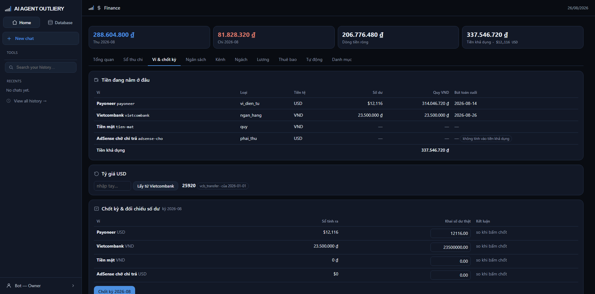

# Tab Ví & chốt kỳ

> Tiền đang nằm ở đâu, tỷ giá bao nhiêu, và cuối kỳ đối chiếu rồi chốt sổ.

## Bảng ví

| Cột | Ghi chú |
|---|---|
| Ví | Tên và mã ví |
| Loại | ví điện tử · ngân hàng · quỹ · khoản phải thu |
| Tiền tệ | Đồng tiền của ví đó |
| Số dư | Nguyên tệ, đúng ký hiệu (USD → $, VND → ₫) |
| Quy VND | Quy theo tỷ giá từng bút toán |
| Bút toán cuối | Ngày phát sinh gần nhất |

Dòng cuối là **Tiền khả dụng** — tổng tất cả ví **trừ** loại *khoản phải thu*.

Ví loại **khoản phải thu** (như AdSense chờ chi trả) có nhãn *"không tính vào
tiền khả dụng"*. Đây là tiền Google đã tính nhưng chưa chuyển; đưa vào số khả
dụng là tự lừa mình.

Ví chưa phát sinh bút toán nào hiện dấu gạch ngang, không phải số 0.

### Sửa danh sách ví

Mở `apps/to-chuc/rules/danh_muc_vi.csv` bằng Excel:

| Cột | Điền gì |
|---|---|
| `ma` | Mã ngắn không dấu, ví dụ `payoneer` |
| `ten` | Tên hiển thị |
| `loai` | `vi_dien_tu` · `ngan_hang` · `quy` · `phai_thu` |
| `tien_te` | `USD` hoặc `VND` |
| `ghi_chu` | Tùy chọn |

Lưu lại là hệ nhận ngay. **Đừng đổi cột `ma`** của ví đã dùng — bút toán cũ trỏ
theo mã đó.

## Tỷ giá USD

Ba cách lấy, xếp theo thứ tự hệ ưu tiên:

1. **Bấm "Lấy từ Vietcombank"** — hệ gọi trang Vietcombank lấy **giá mua chuyển
   khoản**. Đây là số tiền đồng thực nhận khi bán đô, không phải giá bán.
2. **Vietcombank không phản hồi** → hệ tự thử một nguồn dự phòng.
3. **Cả hai không được** → gõ số vào ô "nhập tay…" rồi bấm nút.

Cạnh con số là nhãn nguồn. Nếu ghi *"của 2026-01-01"* nghĩa là hôm nay chưa lấy
tỷ giá mới, đang dùng lại tỷ giá cũ gần nhất.

Chưa có tỷ giá nào thì nhãn đỏ *"chưa có — bút toán ngoại tệ sẽ bị chặn"*.

**Tỷ giá không bao giờ hồi tố.** Lấy tỷ giá mới hôm nay không làm đổi bút toán
tuần trước.

## Chốt kỳ

Cuối tháng, sau khi đối soát doanh thu xong:

1. Mở từng ví thật (Payoneer, ngân hàng, đếm tiền mặt), xem số dư thực tế.
2. Gõ số đó vào cột **Khai số dư thật**. Hệ điền sẵn số nó tính ra, bạn sửa lại
   cho khớp thực tế.
3. Bấm **Chốt kỳ**.

Nếu có ví lệch, hệ **từ chối chốt** và nói rõ ví nào. Muốn chốt thì phải ghi một
bút toán giải trình khoản chênh đó rồi chốt lại. Không có cách chốt đè lên chênh
lệch — đó là chủ đích.

Chỉ **Owner** được chốt kỳ. Chốt hai lần cùng một kỳ bị chặn.

### Sau khi chốt

Kỳ đã chốt vẫn ghi bút toán được, nhưng dòng đó mang dấu **điều chỉnh kỳ trước**
và hiện riêng. Lịch sử không bị sửa, chênh lệch không bị giấu.
