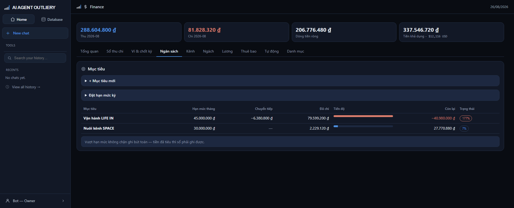

# Tab Ngân sách

> Đặt hạn mức chi mỗi tháng cho từng mục tiêu, và theo dõi tiêu tới đâu.

## Mục tiêu là gì

Mỗi bút toán bắt buộc gắn một **mục tiêu** — để trả lời câu "tiền này phục vụ
việc gì". Ví dụ: *Vận hành LIFE IN*, *Nuôi kênh SPACE*, *Vận hành chung*.

Mục tiêu khác với kênh: một mục tiêu có thể gồm nhiều kênh, và có những khoản
chi không thuộc kênh nào nhưng vẫn phải thuộc một mục tiêu.

## Tạo mục tiêu

Bấm **+ Mục tiêu mới**, điền tên và chọn trạng thái (đang chạy · tạm dừng ·
xong). Ô ngân sách trong form này là số tổng cho cả đời mục tiêu — hạn mức theo
tháng đặt riêng ở dưới.

## Đặt hạn mức mỗi tháng

Bấm **Đặt hạn mức kỳ**:

| Ô | Nghĩa |
|---|---|
| Mục tiêu | Chọn mục tiêu cần đặt |
| Hạn mức mỗi tháng | Số tiền được phép chi trong một tháng |
| Chuyển tiếp phần chưa tiêu | Có: tháng này tiêu thiếu thì tháng sau được cộng thêm |

Chọn **có** cho chuyển tiếp khi mục tiêu có nhịp chi không đều — ví dụ mua tài
khoản theo lô, tháng có tháng không. Chọn **không** khi muốn siết đúng mỗi tháng.

## Đọc bảng

| Cột | Nghĩa |
|---|---|
| Hạn mức tháng | Số đã đặt. Nhãn đỏ *chưa đặt* = chưa có hạn mức |
| Chuyển tiếp | Phần dư mang từ tháng trước sang |
| Đã chi | Tổng chi trong tháng, quy ra đồng Việt Nam |
| Tiến độ | Xanh dưới 80% · vàng từ 80% · đỏ khi vượt 100% |
| Còn lại | Hạn mức cộng chuyển tiếp trừ đã chi. Âm nghĩa là đã vượt |
| Trạng thái | Phần trăm đã tiêu |

Mục tiêu **chưa đặt hạn mức** hiện dấu gạch ngang ở cột tiến độ, không phải 0%.

## Vượt hạn mức thì sao

**Hệ không chặn.** Tiền đã tiêu thì sổ phải ghi được — chặn ghi chỉ khiến sổ sai
lệch với thực tế. Hệ chỉ:

- chuyển thanh tiến độ sang đỏ và hiện phần trăm vượt;
- đưa lên mục "Việc cần làm" ở tab Tổng quan.

Người quyết cắt hay tăng hạn mức là bạn, không phải phần mềm.
