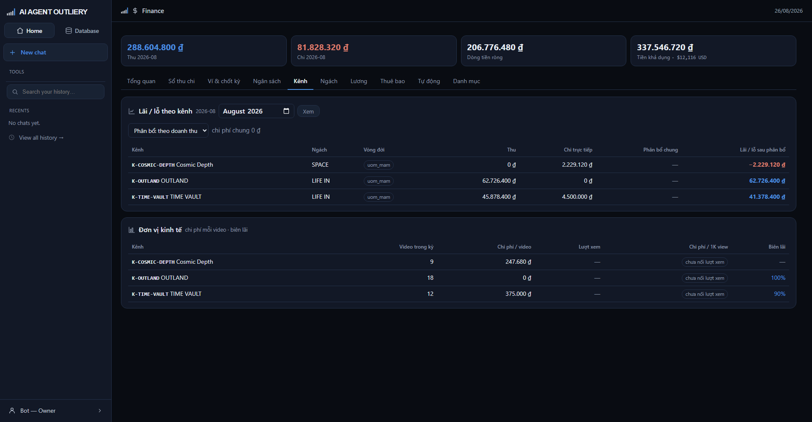

# Tab Kênh

> Kênh nào thật sự lãi sau khi gánh phần chi phí chung, và mỗi video tốn bao nhiêu.

## Vấn đề mà tab này giải

Nhiều khoản chi không thuộc kênh nào: tiền API, tool, lương. Nếu để hết chúng ở
một hàng "chung hệ", bảng sẽ cho thấy **mọi kênh đều có lãi** còn cục lỗ đứng
riêng một dòng không ai đọc. Bảng như vậy nói dối một cách lịch sự.

Tab này rải chi phí chung xuống từng kênh theo một quy tắc bạn chọn.

## Chọn quy tắc phân bổ

Dropdown ở đầu bảng:

| Quy tắc | Chia theo | Hợp khi |
|---|---|---|
| **theo doanh thu** | Tỷ lệ thu của từng kênh | Kênh nào kiếm nhiều thì gánh nhiều — mặc định |
| **chia đều** | Bằng nhau | Các kênh cùng quy mô, cùng mức chăm sóc |
| **không phân bổ** | Không chia | Muốn xem chi trực tiếp thuần túy |

Đổi dropdown là bảng tính lại ngay. Cạnh đó ghi tổng chi phí chung của kỳ.

## Đọc bảng lãi lỗ

| Cột | Nghĩa |
|---|---|
| Thu | Doanh thu kênh trong kỳ |
| Chi trực tiếp | Chi ghi thẳng cho kênh đó |
| Phân bổ chung | Phần chi phí chung kênh này gánh |
| **Lãi / lỗ sau phân bổ** | Con số thật — xanh là lãi, đỏ là lỗ |

Nếu chung hệ **thu nhiều hơn chi** (ví dụ tháng có nạp vốn), thì không có chi phí
chung để rải: cột phân bổ để trống và khoản đó nằm nguyên ở hàng chung hệ. Hệ
không rải số âm để "tặng" tiền cho kênh.

## Đơn vị kinh tế

Bảng dưới trả lời câu hỏi thật của nghề: **nuôi tiếp hay bỏ**.

| Cột | Nghĩa |
|---|---|
| Video trong kỳ | Số video xuất bản, đọc từ PlannerY |
| Chi phí / video | Chi trực tiếp chia số video |
| Lượt xem | Từ Data Analytics — **chưa nối, nên đang để trống** |
| Chi phí / 1K view | Cần lượt xem mới tính được |
| Biên lãi | Phần trăm lãi trên doanh thu |

Các nhãn bạn sẽ gặp:

- **chưa đủ dữ liệu** — kênh chưa xuất bản video nào trong kỳ nên không chia được.
- **chưa nối lượt xem** — phần Data Analytics chưa nối vào.
- **dấu gạch ngang** ở biên lãi — kênh chưa có doanh thu, không có gì để chia.

Chi phí bằng **0** thì hiện `0 ₫`, không phải "chưa đủ dữ liệu" — không có chi
phí khác với không biết chi phí.

## Kênh không hiện trong bảng

Bảng chỉ liệt kê kênh **có phát sinh** trong kỳ. Kênh chưa thu chi gì thì không
có dòng — muốn thấy đủ danh sách kênh thì xem ở khu Danh bạ.
