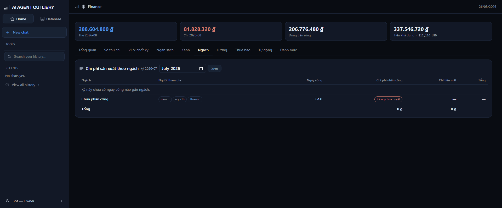

# Tab Ngách

> Ngách nào ngốn người, ngách nào ngốn tiền. Chi phí nhân công quy từ **ngày công**.

## Cách hệ tính

Owner chốt: *chi phí sản xuất cho một ngách tính bằng số ngày công làm cho ngách đó*.

Hệ ghép ba nguồn:

1. **Chấm công** — mỗi người trong kỳ có bao nhiêu ngày công.
2. **PlannerY** — người đó được phân công cho ngách nào.
3. **Bảng lương đã duyệt** — đơn giá một ngày công của người đó.

Rồi nhân lên: `ngày công cho ngách × đơn giá ngày`.

Người làm nhiều ngách thì ngày công **chia đều** cho các ngách được phân công.
Khi PlannerY có lịch video gắn tên người, hệ sẽ tự chuyển sang chia theo số
video — dữ liệu chính xác hơn thì thắng.

## Đọc bảng

| Cột | Nghĩa |
|---|---|
| Ngách | Mã và tên ngách |
| Người tham gia | Ai có ngày công cho ngách này |
| Ngày công | Tổng ngày công đã rải cho ngách |
| Chi phí nhân công | Ngày công nhân đơn giá |
| Chi tiền mặt | Chi ghi cho các kênh thuộc ngách |
| Tổng | Cộng hai cột trên |

Dòng cuối là tổng, và **phải khớp đúng tổng bảng lương đã duyệt** — hệ có phép
kiểm tự động cho đẳng thức này.

## Các nhãn thường gặp

**chưa phân công** — người có ngày công nhưng PlannerY chưa gán ngách nào. Ngày
công của họ vào hàng riêng cuối bảng, **không rải bừa** cho các ngách khác.

**lương chưa duyệt** — kỳ đó chưa duyệt bảng lương nên chưa có đơn giá ngày. Ngày
công vẫn hiện nhưng chưa thành chi phí. Lấy lương dự kiến làm chi phí là bịa số.

**Không đọc được phân công từ PlannerY** — cả khối để trống. Hệ không đoán ai làm
ngách nào.

## Muốn số này đúng thì cần

1. Chấm công kỳ đó đã chốt.
2. Bảng lương kỳ đó đã duyệt (có đơn giá ngày).
3. PlannerY có phân công người vào dự án, và dự án có gắn mã ngách.

Thiếu bất kỳ cái nào, hệ nói thẳng thiếu gì chứ không đưa ra con số nửa vời.
