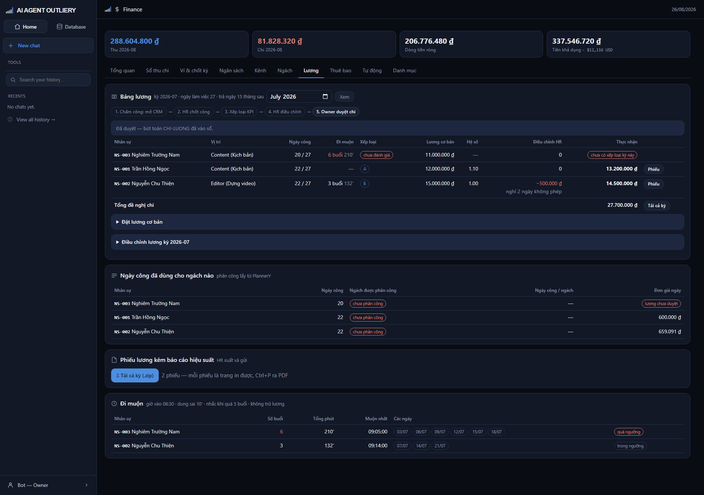
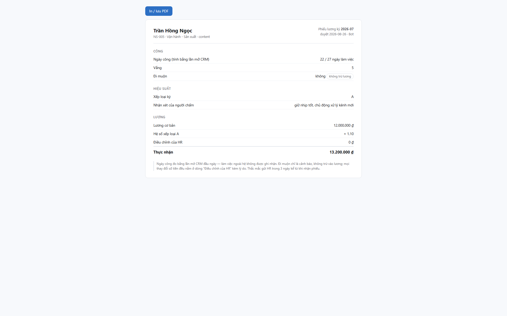

# Tab Lương

> Bảng lương dựng từ chấm công, cảnh báo đi muộn, và phiếu lương gửi từng người.



## Nguyên tắc quan trọng nhất

**Máy không tự trừ tiền của ai.**

Công thức chỉ có:

```
Thực nhận = Lương cơ bản × Hệ số xếp loại + Điều chỉnh của HR
```

Ngày công và đi muộn **không** nằm trong công thức. Chúng hiện ra để HR nhìn mà
quyết. Muốn trừ thì nhập vào ô **Điều chỉnh HR** kèm lý do — và lý do đó nằm lại
vĩnh viễn trong bảng lương đã duyệt.

Lý do: chấm công đo bằng *lần mở CRM*, tức là hiện diện trên hệ công cụ. Người
đi họp, quay ngoài hiện trường không được ghi nhận. Trừ lương dựa trên con số đó
là trừ oan.

## Năm bước

Dải bước trên đầu cho biết đang ở đâu:

1. **Chấm công** — tự động, mỗi lần mở CRM.
2. **HR chốt công** — làm ở HR Hub. Chưa chốt thì nút duyệt lương khóa.
3. **Xếp loại KPI** — chấm A/B/C cho từng người.
4. **HR điều chỉnh** — nếu cần cộng trừ gì.
5. **Owner duyệt chi** — sinh bút toán lương vào sổ.

## Đọc bảng lương

| Cột | Nghĩa |
|---|---|
| Ngày công | Số ngày có mở CRM / số ngày làm việc của tháng |
| Đi muộn | Số buổi và tổng phút. Đỏ nghĩa là quá ngưỡng |
| Xếp loại | A · B · C, hoặc nhãn đỏ *chưa đánh giá* |
| Lương cơ bản | HR đặt ở khối bên dưới |
| Hệ số | Theo xếp loại: A 1,10 · B 1,00 · C 0,90 |
| Điều chỉnh HR | Số cộng/trừ kèm lý do |
| Thực nhận | Số cuối cùng, hoặc nhãn đỏ nói thiếu gì |

Người thiếu dữ liệu (chưa có lương cơ bản, hoặc chưa xếp loại) hiện nhãn đỏ và
**không vào tổng**. Duyệt được phần còn lại; người thiếu ghi bù bằng bút toán sau.

Tài khoản hệ thống không gắn hồ sơ nhân sự **không xuất hiện** trong bảng.

## Đặt lương cơ bản

Bấm **Đặt lương cơ bản**, chọn người và nhập số. Mỗi lần đặt là một bản ghi mới,
bản sau đè bản trước khi hiển thị nhưng lịch sử vẫn giữ — biết ai đặt bao nhiêu,
lúc nào.

## Điều chỉnh lương

Bấm **Điều chỉnh lương kỳ...**:

- **Số tiền** — số âm là trừ, số dương là cộng (thưởng nóng).
- **Lý do** — **bắt buộc**. Không có lý do thì hệ từ chối.

## Duyệt chi

Chỉ **Owner** thấy nút này, và chỉ khi công đã chốt. Chọn mục tiêu và ví trả
lương rồi bấm duyệt. Hệ sinh **một bút toán cho mỗi người** đủ dữ liệu.

Duyệt hai lần cùng một kỳ bị chặn — không chi đôi.

## Ngày công đã dùng cho ngách nào

Khối này để **kiểm chứng** con số ở tab Ngách: mỗi người có bao nhiêu ngày công,
rải cho ngách nào, đơn giá bao nhiêu. Nhìn ra ngay ai đang dồn công vào đâu và
ngày công nào chưa có địa chỉ.

## Phiếu lương

Bấm **Phiếu** ở cuối dòng để xem phiếu của một người, hoặc **Tải cả kỳ (.zip)**
để lấy hết một lượt rồi gửi.



Phiếu gồm: công · đi muộn (ghi rõ *không trừ lương*) · xếp loại và nhận xét ·
ngách đã tham gia · chi tiết lương. Bấm **In / lưu PDF** hoặc Ctrl+P để xuất PDF.

Chỉ kỳ **đã duyệt** mới có phiếu — không có phiếu nháp nào trôi ra ngoài.

## Cảnh báo đi muộn

Bảng cuối trang: ai muộn mấy buổi, tổng bao nhiêu phút, muộn nhất lúc nào, những
ngày nào.

Cách tính: so **lần mở CRM đầu ngày** với giờ vào chuẩn. Quá dung sai mới tính
là một buổi muộn, nhưng số phút đếm từ giờ chuẩn. Ngày không mở CRM là **vắng**,
không tính là muộn.

Sửa giờ chuẩn trong `apps/to-chuc/rules/gio_lam_viec.csv`: giờ vào, dung sai
(phút), ngưỡng nhắc (số buổi/tháng).

Đây là **tín hiệu để HR hỏi**, không phải bằng chứng để phạt.
