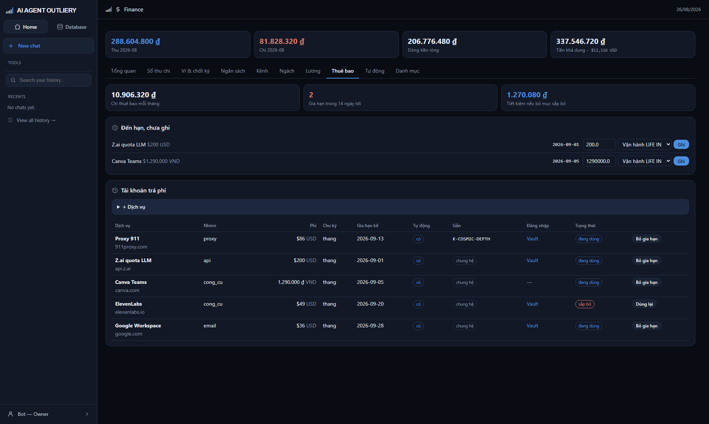

# Tab Thuê bao

> Dịch vụ trả phí định kỳ: khi nào gia hạn, cắt cái gì thì tiết kiệm bao nhiêu.

## Vì sao cần

Phần lớn chi phí hạ tầng nuôi kênh là khoản lặp hằng tháng: proxy, quota LLM,
tool dựng, hộp thư. Gõ tay mười lăm dòng mỗi tháng là việc sẽ bị bỏ sau tháng
thứ hai — và sổ chết theo.

Khai một lần ở đây, đến hạn hệ nhắc.

## Ba ô số

| Ô | Nghĩa |
|---|---|
| Chi thuê bao mỗi tháng | Tổng quy về tháng (gói năm chia 12, gói quý chia 3) |
| Gia hạn trong 14 ngày tới | Số khoản sắp phải trả |
| Tiết kiệm nếu bỏ mục sắp bỏ | Cắt hết khoản đánh dấu *sắp bỏ* thì đỡ bao nhiêu |

## Đến hạn, chưa ghi

Khối này liệt kê khoản sắp tới hạn **và cả khoản đã quá hạn** (chấm đỏ) — quá
hạn mà im lặng là mất tiền oan.

Mỗi dòng có ô số tiền điền sẵn theo phí đã khai, một dropdown mục tiêu, và nút
**Ghi**. Số tiền thật tháng này có thể khác phí khai (đổi gói, đổi tỷ giá) nên
ô đó **sửa được** trước khi ghi.

Bấm Ghi thì hệ tạo bút toán chi và **đẩy ngày gia hạn sang kỳ kế tiếp**.

Hệ **không tự ghi**. Số tiền thật có thể khác, và sổ tiền không được chứa số máy
đoán.

## Khai dịch vụ mới

Bấm **+ Dịch vụ**:

| Ô | Ghi chú |
|---|---|
| Tên · Nhà cung cấp | Để nhận ra khi đối chiếu sao kê |
| Nhóm | proxy · api · cong_cu · email · khac |
| Phí · Tiền tệ | Phí một kỳ |
| Chu kỳ | tháng · quý · năm · một lần |
| Gia hạn kế | Ngày phải trả tiếp theo |
| Ghi vào mã khoản | Bút toán sinh ra sẽ mang mã này |
| Trả bằng ví | Ví nào trả |
| Kênh | Để trống nếu dùng chung |
| Trạng thái | đang dùng · sắp bỏ · đã hủy |
| Tự động gia hạn | Nhà cung cấp có tự trừ tiền không |
| Mã mục trong Vault | Chỉ **mã**, không nhập tài khoản hay mật khẩu |

## Không có cột mật khẩu, và sẽ không bao giờ có

Bảng này giữ **lịch gia hạn**; Vault giữ **bí mật**. Hai kho, hai vai.

Cột "Đăng nhập" chỉ là đường dẫn sang mục tương ứng trong Vault, và chỉ Owner mới
thấy. Vào Vault phải có mật khẩu chủ, và mỗi lần xem đều bị ghi nhật ký.

## Bỏ gia hạn

Nút **Bỏ gia hạn** ở cuối dòng chuyển trạng thái sang *sắp bỏ*. Khoản đó lập tức
vào ô "tiết kiệm nếu bỏ" để bạn thấy cắt được bao nhiêu.

App **không tự hủy** dịch vụ — hủy vẫn là việc tay trên trang nhà cung cấp. Ở
đây chỉ ghi nhận quyết định để tháng sau khỏi mất tiền oan.

Đổi ý thì bấm **Dùng lại**.
