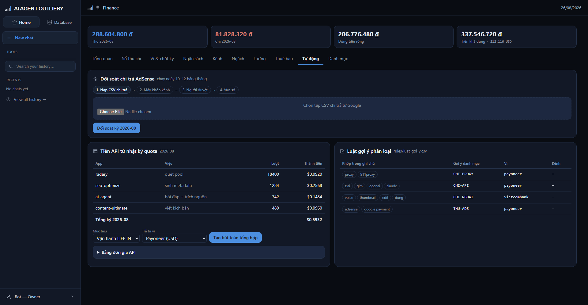

# Tab Tự động

> Ba việc lặp lại hằng tháng, hệ dựng sẵn để bạn duyệt: đối soát doanh thu, quy
> tiền API, và gợi ý phân loại.

## Đối soát chi trả AdSense

Doanh thu AdSense đi qua ba trạng thái khác nhau về bản chất: ước tính trong
Studio → chốt cuối tháng → tiền thật về ví. Ghi tay một lần là chọn sai ở hai
bước còn lại.

**Làm ngày 10–12 hằng tháng**, khi Google đã chốt tiền:

1. Tải tệp CSV chi trả từ trang AdSense.
2. Chọn tệp ở khối này rồi bấm **Đối soát**.
3. Hệ mở bảng nháp: mỗi dòng trong tệp khớp với một kênh trong danh bạ.

| Cột | Nghĩa |
|---|---|
| Kênh trong tệp | Tên như Google ghi |
| Khớp danh bạ | Nhãn xanh = hệ tự khớp chắc chắn |
| Ước tính đã ghi | Doanh thu bạn đã ghi trước đó trong kỳ |
| Tiền thật | Số Google trả — **sửa được** |
| Chênh | Lệch giữa hai số |

Tên không khớp kênh nào thì dropdown để trống cho bạn chọn — hệ **không đoán bừa**.

4. Chọn mục tiêu và ví, bấm **Duyệt & ghi**.

Trước khi bấm duyệt, **sổ chưa nhận dòng nào**. Bảng nháp chỉ là bảng nháp.

Tệp thiếu cột tên kênh hoặc số tiền thì hệ báo lỗi rõ ràng, không nuốt.

## Tiền API từ nhật ký quota

Mọi lần gọi API ngoài đều được ghi log kèm app, việc, số lượt. Đó là chi phí thật,
chảy hằng ngày mà trước giờ chưa bao giờ thành tiền trong sổ.

Bảng gộp theo app và việc, nhân với đơn giá để ra thành tiền.

**Khai đơn giá trước:** mở **Bảng đơn giá API**, nhập mã API (đúng như trong log,
ví dụ `llm_glm`) và số USD mỗi lượt.

API **chưa khai đơn giá** hiện nhãn đỏ và **không được cộng vào tổng** — một con
số không biết thì không được lẫn vào con số biết.

Bấm **Tạo bút toán tổng hợp** để ghi **một** bút toán cho cả tháng; chi tiết vẫn
nằm ở bảng này. Ghi hai lần cùng kỳ bị chặn.

## Luật gợi ý phân loại

Bảng bên phải liệt kê luật đang có. Khi bạn gõ ghi chú trong cửa sổ bút toán mới,
nếu khớp thì hệ **điền sẵn** danh mục, ví, kênh — kèm dòng chữ *"đã điền sẵn,
sửa được"*.

Sửa luật trong `apps/to-chuc/rules/luat_goi_y.csv`:

| Cột | Điền gì |
|---|---|
| `khop` | Các từ khóa, cách nhau bằng dấu `;` |
| `danh_muc` | Mã khoản gợi ý |
| `vi` | Ví gợi ý |
| `kenh_ma` | Kênh gợi ý, để trống nếu không |

So chữ **không phân biệt hoa thường và không phân biệt dấu** — gõ "Z.AI" hay
"z.ai" đều khớp. Luật đầu tiên khớp thì dừng.

Không khớp luật nào thì hệ im lặng, không áp bừa.
