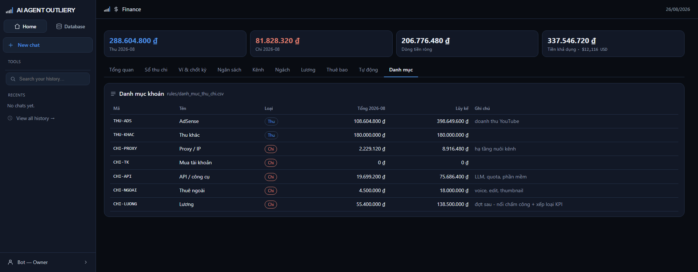

# Tab Danh mục

> Bảng mã khoản thu chi — xương sống phân loại của cả khu Finance.

## Mã khoản làm gì

Mỗi bút toán phải chọn một mã khoản, và **chính mã đó quyết định đây là thu hay
chi**. Người ghi không chọn được lệch — chọn `THU-ADS` thì là thu, chọn
`CHI-PROXY` thì là chi.

Mã khoản cũng là trục của biểu đồ cơ cấu chi và bảng tổng hợp.

## Đọc bảng

| Cột | Nghĩa |
|---|---|
| Mã | Mã dùng trong sổ, không đổi |
| Tên | Tên hiển thị trong dropdown |
| Loại | Thu (xanh) hoặc Chi (đỏ) |
| Tổng tháng | Tổng phát sinh trong tháng đang chọn |
| Lũy kế | Tổng từ trước đến nay |
| Ghi chú | Mô tả |

## Sửa danh mục

Mở `apps/to-chuc/rules/danh_muc_thu_chi.csv` bằng Excel:

| Cột | Điền gì |
|---|---|
| `ma` | Mã viết hoa không dấu, ví dụ `CHI-THUE` |
| `ten` | Tên tiếng Việt hiển thị |
| `loai` | `thu` hoặc `chi` |
| `ghi_chu` | Mô tả ngắn |

Lưu lại là hệ nhận ngay ở lần tải trang kế tiếp. **Thêm loại chi phí mới không
cần lập trình viên.**

## Ba điều cần nhớ

**Đừng đổi cột `ma`** của mã đã dùng — bút toán cũ trỏ theo mã đó, đổi là mất
liên kết.

**Đừng xóa mã đã dùng.** Muốn ngừng dùng thì đổi tên thành "(không dùng nữa) ..."
để nó tụt xuống cuối dropdown, nhưng vẫn giữ dòng.

**Dòng gõ sai bị bỏ qua.** Thiếu mã hoặc loại không phải `thu`/`chi` thì hệ lặng
lẽ bỏ dòng đó chứ không vỡ trang — nhưng mã đó sẽ biến mất khỏi dropdown, nên
kiểm lại nếu thấy thiếu.
