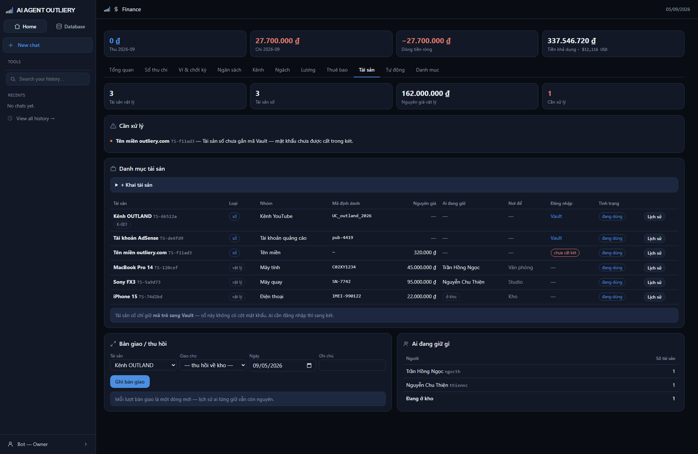

# Tab Tài sản

> Kiểm kê tài sản vật lý và tài sản số, ai đang giữ cái gì, mật khẩu cất ở Vault.

## Hai loại tài sản

| Loại | Gồm | Theo dõi gì |
|---|---|---|
| **Vật lý** | Máy tính, điện thoại, máy quay, màn hình, thiết bị mạng, nội thất | Ai đang giữ, để ở đâu, tình trạng, nguyên giá |
| **Số** | Kênh YouTube, tài khoản quảng cáo, tên miền, proxy/IP, phần mềm bản quyền | Mã định danh, gắn kênh nào, **mã mục trong Vault** |

Nhóm phải khớp loại — chọn loại *Số* thì dropdown nhóm chỉ hiện nhóm của tài sản
số. Máy chủ cũng kiểm lại, không chỉ ẩn trên màn.

## Mật khẩu: hai kho, hai vai

**Sổ tài sản này không có cột mật khẩu, và sẽ không bao giờ có.**

- Sổ tài sản giữ **danh mục**: cái gì, mua bao giờ, ai giữ, để đâu.
- Vault giữ **bí mật**: mật khẩu, mã hai lớp, khóa khôi phục.

Tài sản số chỉ mang **mã mục trong Vault** — một chuỗi trỏ sang két. Cột "Đăng
nhập" hiện đường dẫn sang Vault, và chỉ Owner mới thấy. Vào Vault phải mở bằng
mật khẩu chủ, két tự khóa sau 10 phút, và **mỗi lần xem mật khẩu đều vào nhật ký**.

Tài sản số chưa gắn mã Vault sẽ hiện nhãn đỏ **chưa cất két** và nhảy lên khối
"Cần xử lý" — nghĩa là mật khẩu đang nằm đâu đó ngoài két.

## Khai tài sản

Bấm **+ Khai tài sản**:

| Ô | Ghi chú |
|---|---|
| Loại · Nhóm | Chọn loại trước, nhóm tự lọc theo |
| Tên tài sản | Tên gọi thường ngày |
| Mã định danh | Serial, IMEI, ID kênh, mã publisher… |
| Ngày mua · Nguyên giá | Để tính tổng giá trị đang nắm |
| Nơi để | Văn phòng, Kho, Studio… |
| Tình trạng | đang dùng · đang sửa · hỏng · đã thanh lý |
| Gắn kênh | Nếu tài sản phục vụ riêng một kênh |
| Mã mục trong Vault | **Chỉ mã** — không nhập mật khẩu vào đây |

Tài sản **đã thanh lý** vẫn nằm trong sổ nhưng mờ đi, không tính vào tổng và
không hiện trong dropdown bàn giao.

## Bàn giao và thu hồi

Chọn tài sản, chọn người nhận, ghi ngày. Để trống ô "Giao cho" là **thu hồi về kho**.

Mỗi lượt bàn giao là **một dòng mới** — không sửa dòng cũ. Nhờ vậy hỏi "tháng
trước máy này ai cầm" luôn trả lời được, và khi ai đó nghỉ việc thì tra ra ngay
họ đang giữ những gì.

Bấm **Lịch sử** ở cuối dòng để xem toàn bộ đường đi của một tài sản: ngày nào,
qua tay ai, ghi chú gì, ai là người ghi.

## Khối "Cần xử lý"

Chỉ nêu hai việc, và cả hai đều **đếm được từ dữ liệu thật**:

1. **Người không còn trong danh sách nhân sự mà vẫn giữ tài sản** — nghỉ việc
   chưa thu hồi. Đây là lý do chính khiến đồ công ty biến mất.
2. **Tài sản số chưa gắn mã Vault** — mật khẩu chưa được cất trong két.

Không có việc chung chung, không nhắc những thứ hệ không biết chắc.

## Ai đang giữ gì

Bảng bên phải đếm số tài sản mỗi người đang giữ, kèm dòng cuối là số đang nằm
trong kho. Dùng khi làm thủ tục nghỉ việc: nhìn một phát biết người đó phải trả
lại bao nhiêu món.
